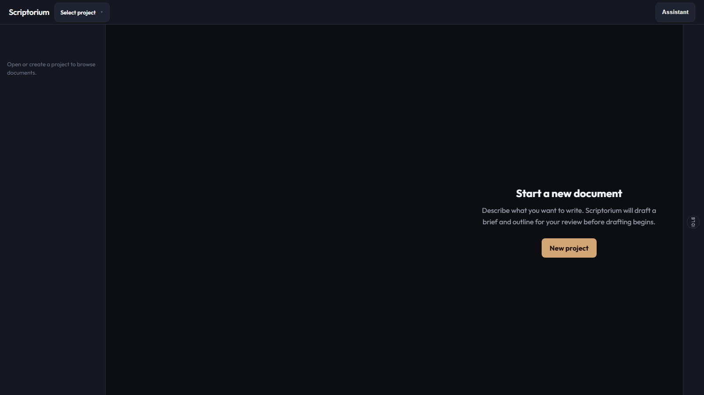

# Scriptorium

**Open-source multi-agent editorial newsroom and portable writing framework for Cursor, Codex, Windsurf, and Copilot.**



[](LICENSE)
[](https://www.python.org/downloads/)
[](https://nodejs.org/)
[](PRODUCTION_READINESS_PLAN.md)

---

## Who this is for

- **Authors and editors** producing long-form technical or narrative work who want a structured newsroom pipeline, not a single chat thread.
- **Teams building agent workflows** who need schemas, quality gates, specialized agents, and MCP-backed memory—not another “write better” system prompt.

---

## Two ways to use this repo

| Path | You get | Success in ~5 minutes |
|------|---------|------------------------|
| **[Run the app](docs/APP.md)** | React workspace + FastAPI + LangGraph | Brief and outline in **Plan**, approve, see a chapter in **Draft** |
| **[Adopt the framework](docs/FRAMEWORK.md)** | Commands, agents, doctrine, MCP servers | `/discovery` → `/write-brief` with schema-valid outputs |

Canonical command specs live in [`.writing-framework/commands/`](.writing-framework/commands/). IDE folders (`.claude/`, `.codex/`, etc.) are **adapters**—edit the framework first, then sync adapters if needed.

---

## Why not just Cursor rules?

- **Schemas and gates** — Brief, outline, and QA outputs must validate; phases do not advance on vibes.
- **Specialized agents** — Commissioning, outline, staff writer, fact-check, managing editor, and more—each with a bounded scope.
- **Durable context** — MCP guide-server, cache-server, and artifact-server for guides, run memory, and exports.

See [docs/GUIDELINES.md](docs/GUIDELINES.md) for contributor lanes and proof requirements.

---

## Newsroom pipeline (app)

You describe a document, audience, and writing mode. The newsroom runs:

| Phase | Agent | Role |
|-------|-------|------|
| **Brief** | Commissioning Editor | Tone, goal, constraints |
| **Outline** | Outline Architect | Chapter structure |
| **Negotiate** | You | **Plan** tab + assistant approval |
| **Draft** | Staff Writer | Sections with fact context |
| **Scrub** | Pattern Scrubber | AI-stink and filler |
| **Copyedit** | Copyeditor | Voice and style |
| **Fact-check** | Fact-Checker | RDF fact graph |
| **Compliance** | Compliance Officer | Compliance RDF |
| **Creative** | Resonance Critic | Pacing and feel |
| **Gate** | Managing Editor | Sign-off or revision loop |

---

## Architecture

```
┌─────────────────────────────────────────────────────────┐
│              React UI (Vite, port 5173 dev)              │
│         Plan | Draft | Preview  +  project sidebar       │
└────────────────────┬────────────────────────────────────┘
                     │  /api REST  +  /ws WebSocket
┌────────────────────▼────────────────────────────────────┐
│                   FastAPI (app.py)                       │
│              LangGraph (orchestrator.py)                 │
│   projects/<id>/artifacts/*.md  +  projects.db           │
└─────────────────────────────────────────────────────────┘
```

Framework and MCP layers: [docs/FRAMEWORK.md](docs/FRAMEWORK.md) · Full layers: [ARCHITECTURE.md](ARCHITECTURE.md)

---

## Quick start — app

**Prerequisites:** Python 3.11+, Node 18+, a Gemini / OpenAI / Anthropic API key.

```bash
git clone https://github.com/DurdeuVlad/scriptorium.git
cd scriptorium

pip install -r requirements.txt
cp .env.example .env   # add your API key

cd frontend && npm ci
```

**Two terminals:**

```bash
# Terminal A — API
python -m uvicorn app:app --reload --port 8000

# Terminal B — UI
cd frontend && npm run dev
```

Open **http://localhost:5173** → **+ New** → review **Plan** → approve in the **Assistant** → open chapters under **Draft**.

Docker: [docs/APP.md](docs/APP.md#docker). API details: same doc.

---

## Quick start — framework

1. Copy or install [`.writing-framework/`](.writing-framework/) into your repo (see `/install-framework` in [COMMAND_REGISTRY.md](.writing-framework/commands/COMMAND_REGISTRY.md)).
2. Register MCP servers under [`mcp/`](mcp/) per [MCP_INSTALLATION.md](MCP_INSTALLATION.md).
3. In your AI tool: run **`/discovery`**, then **`/write-brief`**, validate against [`.writing-framework/schemas/`](.writing-framework/schemas/).
4. Prove changes with [evals/cases/case-01-technical-docs.md](evals/cases/case-01-technical-docs.md).

Full walkthrough: [QUICK_START.md](QUICK_START.md)

---

## Documentation map

| Doc | Contents |
|-----|----------|
| [docs/APP.md](docs/APP.md) | REST/WS API, Docker, env vars, UI smoke |
| [docs/FRAMEWORK.md](docs/FRAMEWORK.md) | Layers, MCP, commands, install |
| [docs/GUIDELINES.md](docs/GUIDELINES.md) | Human contributor checklist |
| [docs/FAQ.md](docs/FAQ.md) | Common questions |
| [AGENTS.md](AGENTS.md) | Agent operating manual |
| [CONTRIBUTING.md](CONTRIBUTING.md) | PR workflow |
| [ROADMAP.md](ROADMAP.md) | Phase history and plans |
| [PRODUCTION_READINESS_PLAN.md](PRODUCTION_READINESS_PLAN.md) | Alpha status and verification gaps |

---

## Project status (alpha)

| Layer | Maturity |
|-------|----------|
| App UI + local run | Runnable; no auth by default, opt in with `API_AUTH_TOKEN` (see `.env.example`) |
| LangGraph pipeline | Core agents wired; guide-server not yet in live prompts |
| Framework specs | Broad command/agent coverage; end-to-end eval proof pending |
| Hosted production | Not ready — pipeline eval proof still pending (see `PRODUCTION_READINESS_PLAN.md`); auth + rate limiting are available if you do deploy the "prod" `docker-compose` profile, but treat this as beta-grade hardening, not a substitute for your own review |

**Validation:** Framework path targets [case-01](evals/cases/case-01-technical-docs.md); publish baseline scores in [evals/BASELINE_COMPARISON.md](evals/BASELINE_COMPARISON.md) when available.

---

## Roadmap (high level)

- [x] Multi-project app, Plan/Draft/Preview, Docker, Playwright smoke
- [x] Framework phases 1–12 implemented (verification in progress)
- [x] Optional API token auth + rate limiting (`API_AUTH_TOKEN`, see `docs/APP.md#security`)
- [ ] Wire guide-server into LangGraph prompts
- [ ] Multi-session “continue chapter N”
- [ ] Hosted production readiness (pipeline eval proof, see `PRODUCTION_READINESS_PLAN.md`)

Details: [ROADMAP.md](ROADMAP.md)

---

## Contributing

Read [CONTRIBUTING.md](CONTRIBUTING.md), [docs/GUIDELINES.md](docs/GUIDELINES.md), and [CODE_OF_CONDUCT.md](CODE_OF_CONDUCT.md). Security: [SECURITY.md](SECURITY.md).

---

## License

[MIT](LICENSE) — Copyright (c) 2026 DurdeuVlad

---

## About

Built by [DurdeuVlad](https://github.com/DurdeuVlad).

*Scriptorium — where every word earns its place.*
